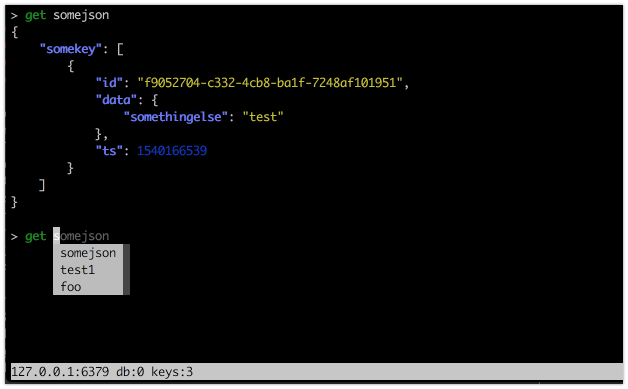
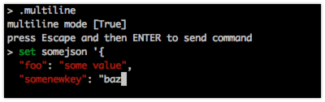
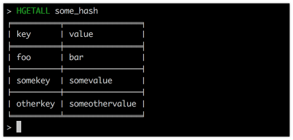

A fancier redis client
=======================

Some Features
=======================

Multiline Paste
----------------
You can paste some long string as you'd like, useful for pasting data from your editor.

Multiline Edit
----------------
Edit long data in place

Printing tables
------------------
Some commands prints tables

Inline lua script highlight
---------------------------

Note
=======================

This is currently in progress. So it will be changed a lot.